> If you are interested in aquiring a pre-built devboard, please contact @abenstirling on the [Discord](https://discord.gg/HYT2UBpeHM) server. Otherwise the hardware exports are found [here](https://github.com/open-tags/opentag/tree/main/Hardware/devboard_v1_exports), and the BOM is found [here](https://github.com/open-tags/opentag/tree/main/Hardware/bom)

The goal for the hardware is to have a fully integrated:

- Microcontroller
- UWB module
- Lights for visual feedback
- Battery management system (for low power consumption)

### Devboard


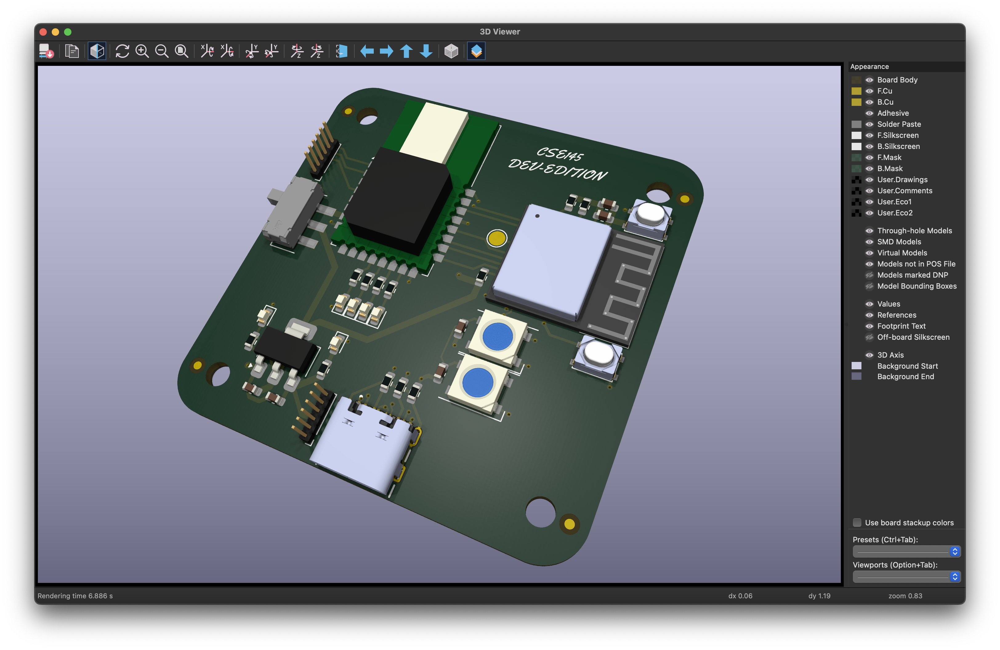
We currently have a devboard that is being used for development. The devboard is a custom PCB that has the following components:

- ESP32-C3-MINI-1
- DWM3000
- 2x RGB LED
- USB-C for power and programming

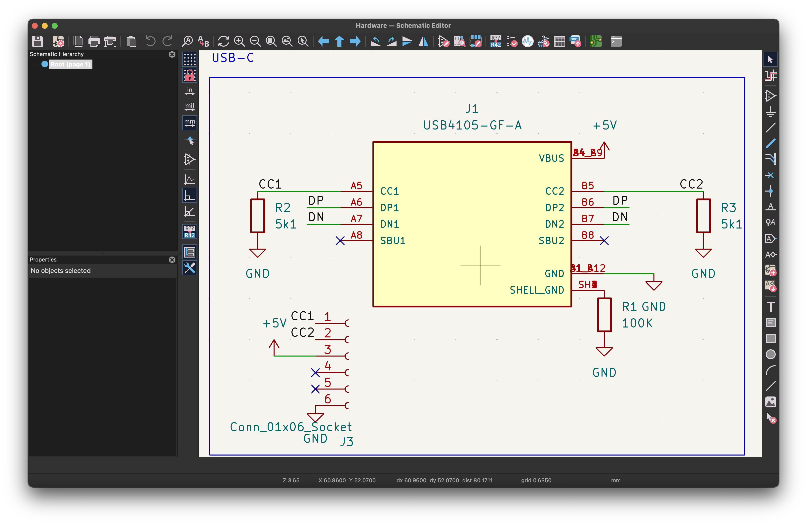

For the input, we need typical USB-C pins. I didn't connect any pin other than the required ones for it to function with data and power. `DP` and `DN` are for data, `VBUS` is for `+5V`, and `GND` is for `GND`. I also have an output for us to check for shorts and worst-case to power the board.

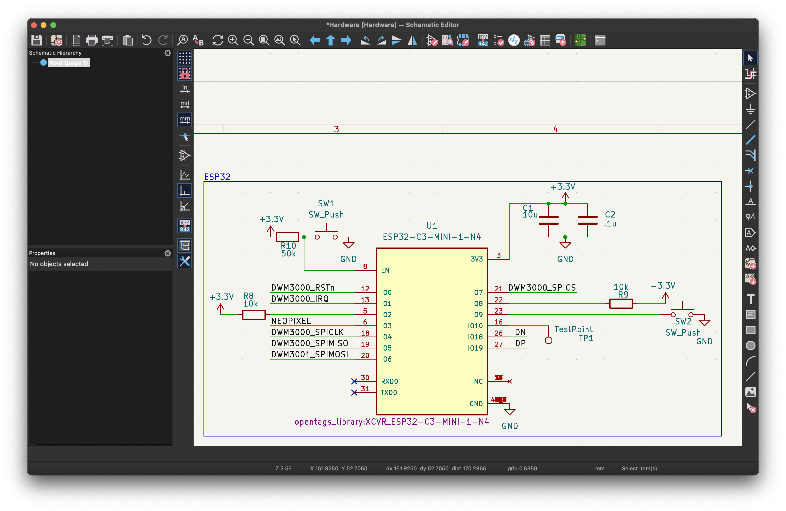

For the ESP32, this was gathered mostly from the datasheet. Shoutout to the [ESP32-C3-MINI-1](https://www.espressif.com/sites/default/files/documentation/esp32-c3-mini-1_datasheet_en.pdf) datasheet! Most importantly, we have `Boot` and `Reset` buttons. We have two [bypass caps](https://www.electronicshub.org/bypass-capacitor-tutorial/) with `+3.3V`. A big thing to realize (that is actually non-trivial) is that the pins on the footprint/symbol are not the same as the `GPIO` pins on the ESP32. This is because the ESP32 has a different pinout than the footprint. Just remember!

We wire up the following:

```DWM3000_RSTn - IO0
DWM3000_IRQ - IO1
DWM3000_SPICLK - IO4
DWM3000_SPIMISO - IO5
DWM3000_MOSI - IO6
DWM3000_SPICS - IO7
```

`DP` and `DN` are always on `IO19` and `IO18` respectively. The `IO10` is a testpoint, not sure why.

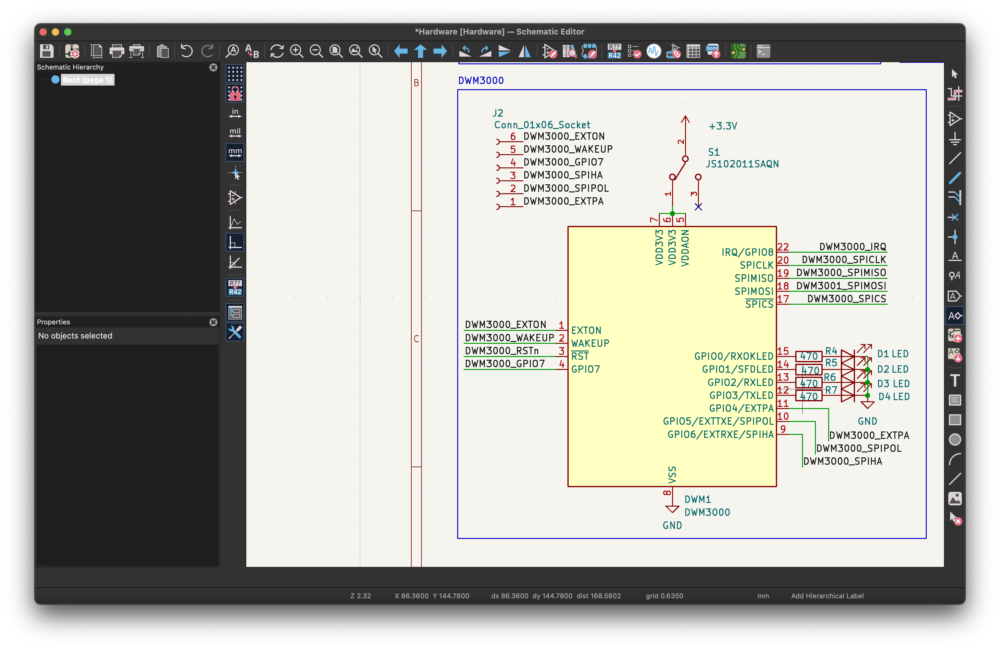

Again, this is retrieved from the datasheet. LED/resistors are used to debug when figuring out SPI comms.

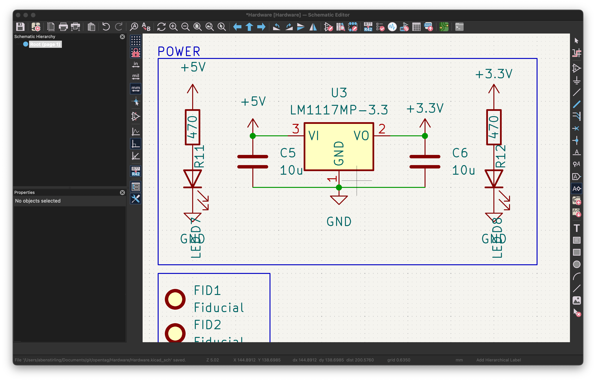
The `LM1117MP-3.3` just needs `10u` bypass caps on either side. I also put LED/resistors for debugging power.

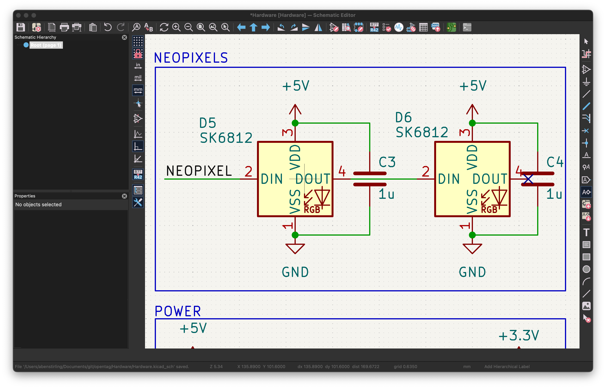
The `SK6812` just need `1u` bypass caps, they are "daisychained" so are controlled by `NEOPIXEL` pin, `GPIO3`.

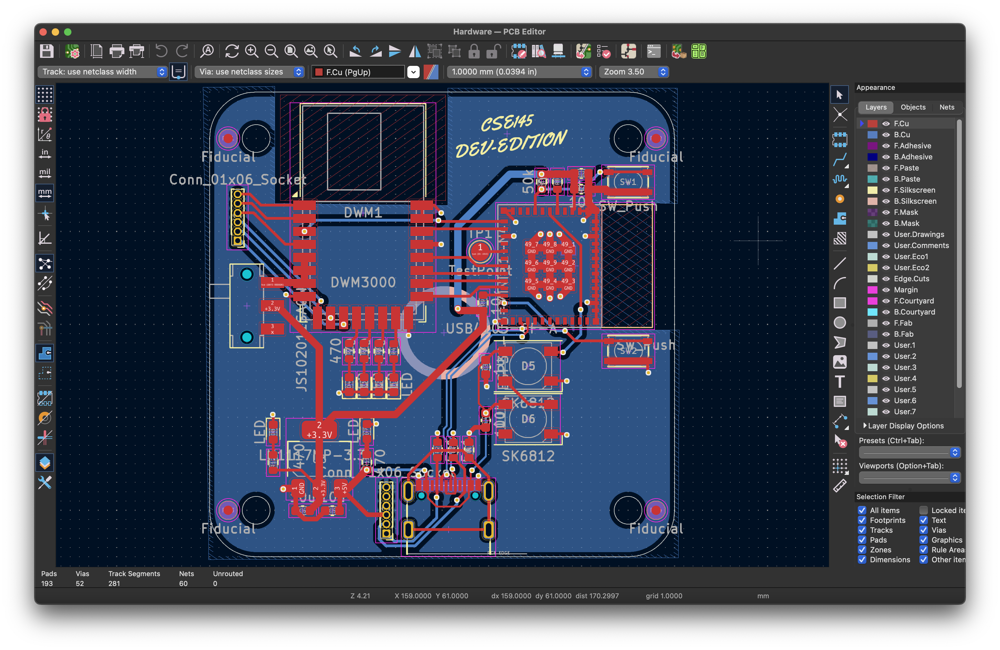
They layout is quite supreme, as the ESP32 is just nicely perpendicular to the `DWM3000`. The board is `50mm X 50mm`, with `5mm£` radius corners, and `3mm` mounting holes on a `40mm` grid. The only thing to note is that I did not fill copper on either layer under the antennas of the wireless chips, likely to help with proper signal.

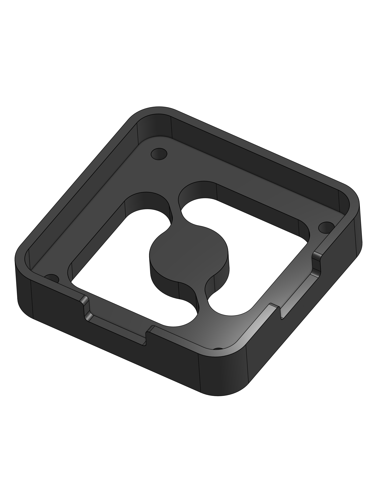
The devboard is housed in a 3D printed case. The case is designed to be small and portable. The case has a hole for the USB-C port, and a hole for the the switch to switch power. A true mechanical wonder.

### Battery Tester

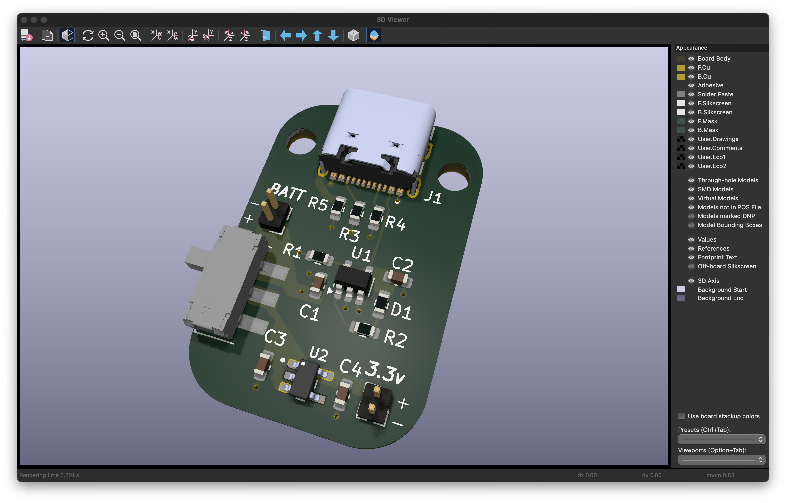
For testing our battery management system, we have a battery connector that can be used to connect a battery to the devboard. The requirements are as follows:

- USB-C for power and programming
- Battery connector
- Voltage regulator
- Battery management system

Let's take a look at the battery tester in more detail:

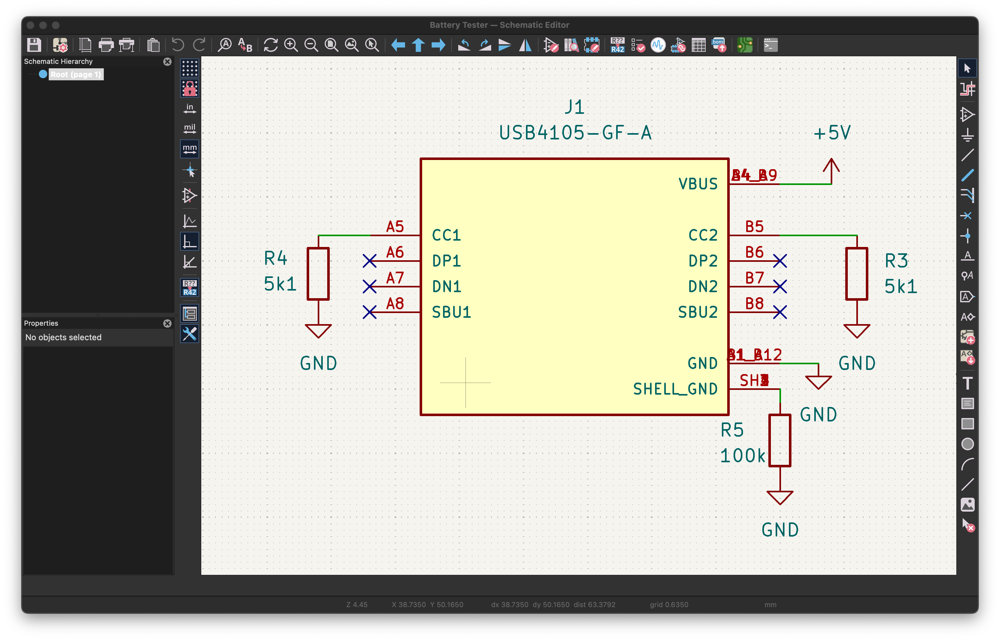

For input, we have a USB-C. I didn't connect any pin other than the required ones for it to function as a power source. `CC1` and `CC2` always need `5k1` pulldown resistors, and `SHELL_GND` always needs a `100k` pulldown. We used `VBUS` for `+5V` and `GND` for `GND`.

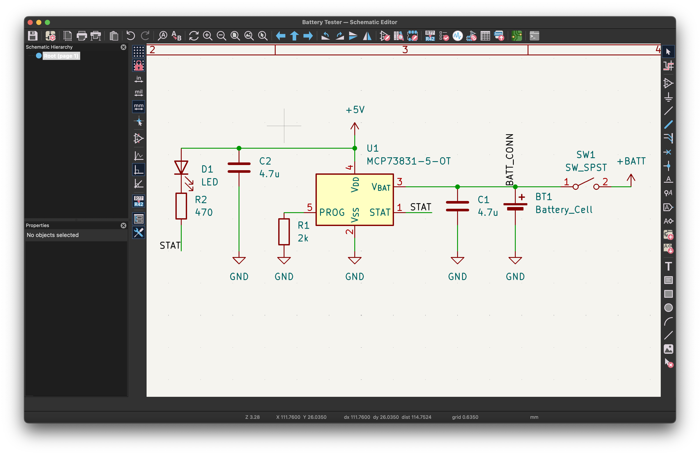

We have the meat of the battery board here. We have a `MCP73831-5-OT` which is an IC that is meant for this type of application. [Mew463's ESP32 Caliper](https://github.com/Mew463/esp32-caliper/tree/main) was a big help to apply some of the concepts from the datasheet. We added a switch so the user can turn off the battery power at any point.

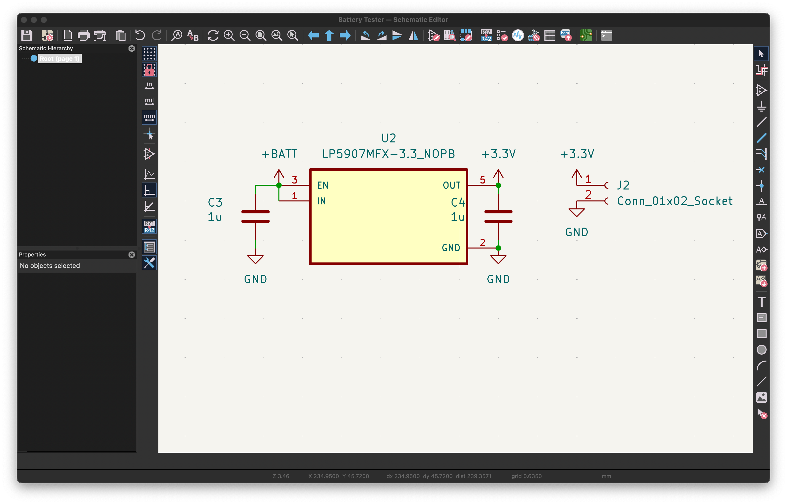
For the output, I decided to have a `LP5907MFX-3.3_NOPB` regulator right next to the battery because it is meant for the battery. The two ouput pins are meant to be connected to the `3V3` and `GND` pins on the opentag devmodule.

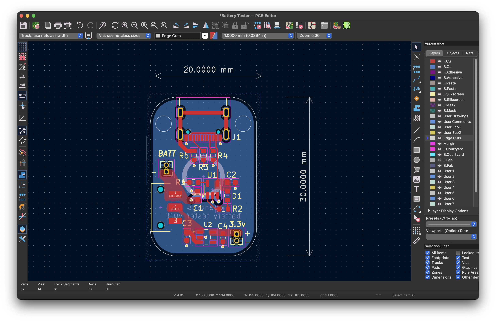
For routing, I tried to use as many power puddles as possible. I also tried to keep the traces as short as possible. I also tried to keep the traces as wide as possible. Nothing too special here.
