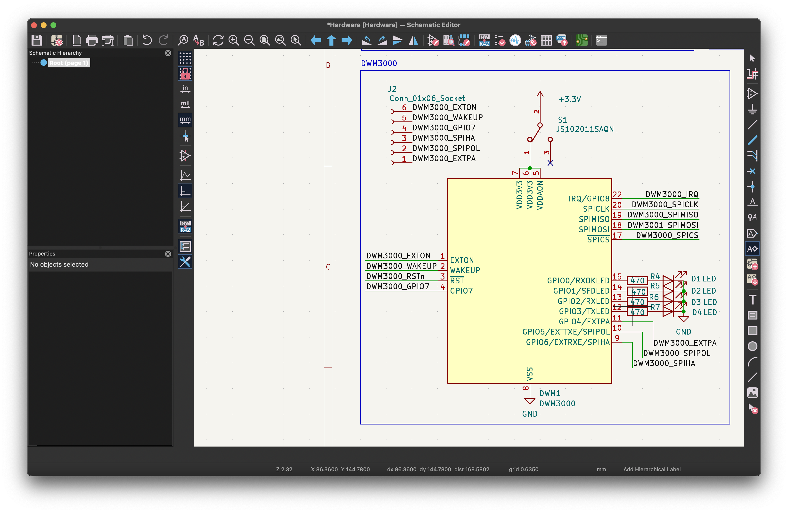
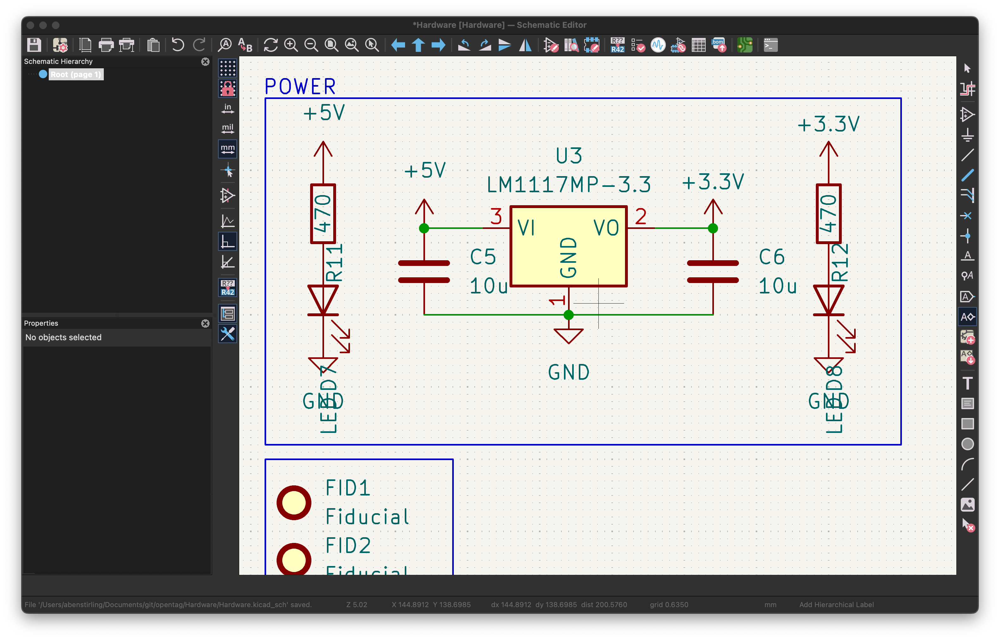
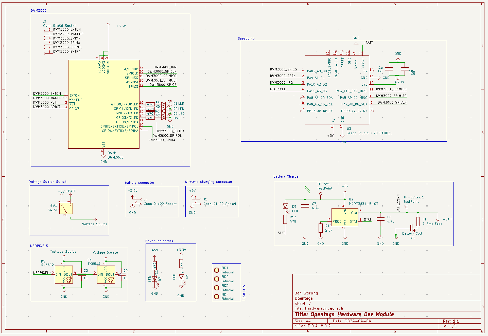

> If you are interested in aquiring a pre-built devboard, please contact @abenstirling on the [Discord](https://discord.gg/HYT2UBpeHM) server. Otherwise the hardware exports are found [here](https://github.com/open-tags/opentag/tree/main/Hardware/devboard_v1_exports), and the BOM is found [here](https://github.com/open-tags/opentag/tree/main/Hardware/bom)

The goal for the hardware is to have a fully integrated:

- Microcontroller
- UWB module
- Lights for visual feedback
- Battery management system (for low power consumption)

### Devboard


We currently have a devboard that is being used for development. The devboard is a custom PCB that has the following components:

- SEED XIAO nrF52840
- DWM3000
- 2x RGB LED
- USB-C for power and programming

We wire up the following:

```
DWM3000_RSTn - D1
DWM3000_IRQ - D2
DWM3000_SPICLK - D8
DWM3000_SPIMISO - D9
DWM3000_MOSI - D10
DWM3000_SPICS - D0
```

Most of the inspiration here is taken from the data sheet.



Again, this is retrieved from the datasheet. LED/resistors are used to debug when figuring out SPI comms.

There are also 4 LEDS attached to the DWM-3000. These represent (left-to-right):
1. Tx Frame Sent
2. Rx Frame Received
3. SFD
4. Rx Frame OK


The `LM1117MP-3.3` just needs `10u` bypass caps on either side. I also put LED/resistors for debugging power.


The `SK6812` just need `1u` bypass caps, they are "daisychained" so are controlled by `NEOPIXEL` pin, `GPIO3`.


The layout is auite supreme (not as much as the previous). It is pretty similar to v0, however, with the XIAO board instead of the ESP-32 and no external USB-C connector since it came with the XIAO board.

### Battery Tester

For testing our battery management system, we have a battery connector that can be used to connect a battery to the devboard. The requirements are as follows:

- USB-C for power and programming
- Battery connector
- Voltage regulator
- Battery management system

Instead of using a separate LP5907 regulator in the battery tester circuit (as done in v0), we have integrated the tester directly with the regular development board (Seduino). The battery output is connected straight to the Seduino's battery input, and the Seduino's built-in 3.3V regulator provides the necessary voltage regulation for the circuit.

We also added wireless charging into the board.

Thus here is the overall schematic for the project

