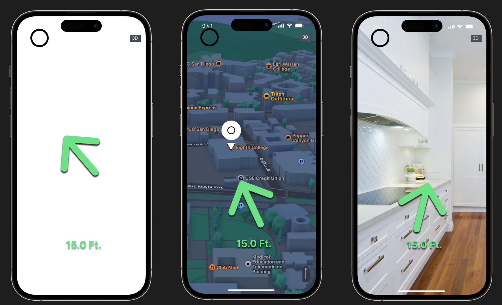
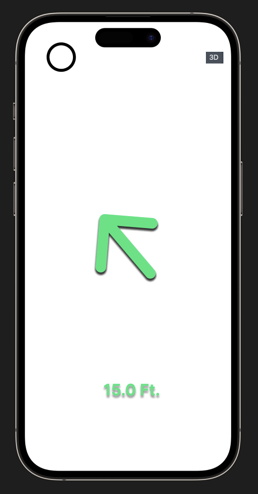
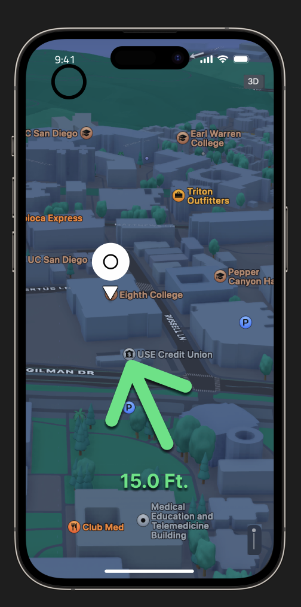
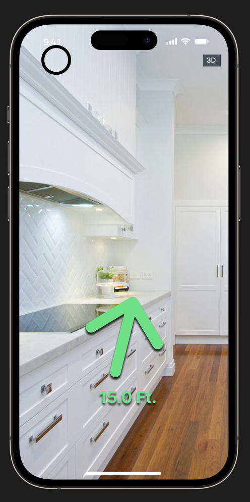

## Wireframe

Our Wireframe consists of 3 UIs that give the User different experiences to visualize their OpenTag. Haptic and auditory feedback will be enabled for distances near the OpenTag to give helpful navigating cues to the user.

### Home

### Map

Using the Map Kit, this UI displays the OpenTag as a pin.

### AR

Using the AR Kit, we utilize the camera to give the user a different perspective on spatial awareness and localization.
