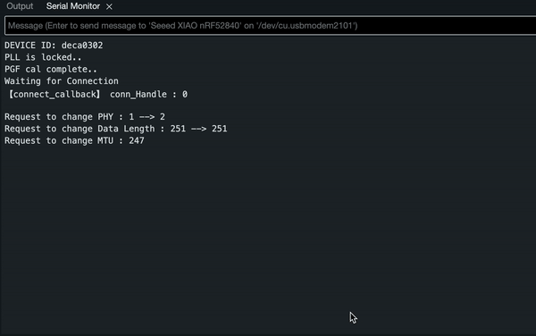

The goal of our app is to convey spatial interaction and localization in an easy to use intuitive UI/UX.

## Wireframe

Our Wireframe consists of 3 UIs that give the User different experiences to visualize their OpenTag. Haptic and auditory feedback will be enabled for distances near the OpenTag to give helpful navigating cues to the user.

### Home

### Map

Using the Map Kit, this UI displays the OpenTag as a pin.

### AR

Using the AR Kit, we utilize the camera to give the user a different perspective on spatial awareness and localization.

## Current Demo

Our application is still a work-in-progress. We are left with adding the Camera AR Assistance!

Currently, we are using the NINearbyAccessorySample demo as a UI in order to test the establishment of the Nearby Interaction Protocol specified in the Apple Nearby Interaction Accessory Protocol Specification - Release 2

States:

- Connectedd to 'Unknown'
- Requesting Configuration Data from Accessory
- Accessory session started.
- Session with 'Unknown' timed out.

As shown, a communication data link is established between the phone and the nrf52840 using Bluetooth. The UI changes based on the state of the protocol. In our case, the UI is stuck in a loop due a blocker in the firmware which is under development.

### Serial Monitor

The serial monitor is used to monitor the serial bus of the nrf when logging in the app. Here we can see the corresponding loop that is present in the demo.

### Debugger

Our debugger is attached to the UI and allows us to see the Accessory Configuration Data that is received from the Qorvo device. It then shows us the Phone's Configuration Data that is written to the DWM3000. Throughout development, the debugger has helped us log errors and ensure data is properly read and written on both ends of the system.

### How to replicate the iOS App

To build this application on your own, we recommend the following procedure
1. Download xCode onto your local machine
2. Download the [Apple Nearby Interaction Demo Code](https://developer.apple.com/documentation/nearbyinteraction)
3. Open the `BluetoothLECentral` File under Bluetooth Support (NINearbyAccessorySample > BluetoothSupport > BluetoothLECentral) and change the serviceUUID to `26b886e0-0bab-4d96-a8f3-f44fe442a700`
4. Build the application onto your iOS device and open it there. This makes it compatible to our accessory via BLE.